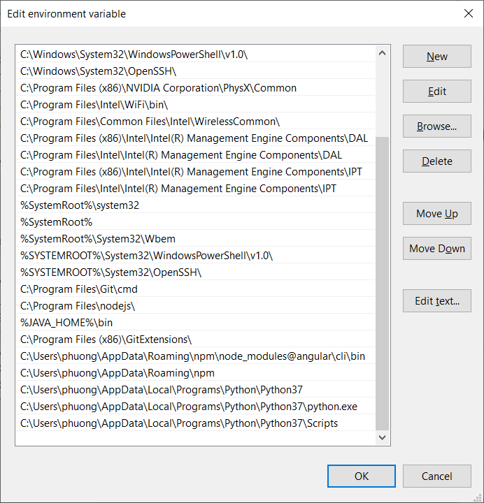
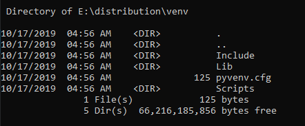
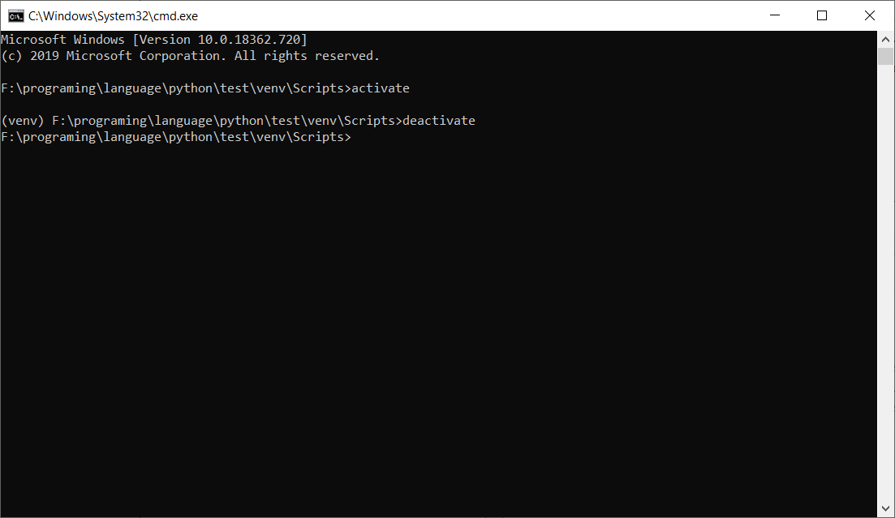
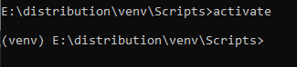
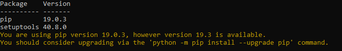
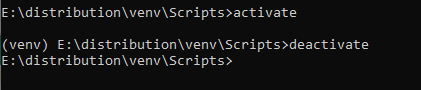

https://www.lynda.com/Python-tutorials/Python-Essential-Training/614299-2.html

…or create a new repository on the command line  
echo "# python-docs" >> README.md  
git init  
git add README.md  
git commit -m "first commit"  
git remote add origin https://github.com/Duy-Phuong/python-docs.git  
git push -u origin master  
                 
…or push an existing repository from the command line  
git remote add origin https://github.com/Duy-Phuong/python-docs.git  
git push -u origin master   


# Create virtual environment using venv | Python

https://www.geeksforgeeks.org/create-virtual-environment-using-venv-python/?ref=leftbar-rightbar

A virtual environment is a tool that helps to keep dependencies required by different projects separate by creating isolated python virtual environments for them. This is one of the most important tools that most of the Python developers use.

Search python/ open file location 
copy path Search: environment System varrible



**Add into PATH: **
C:\Users\phuong\AppData\Local\Programs\Python\Python37 C:\Users\phuong\AppData\Local\Programs\Python\Python37\python.exe

Đối với pip thì thêm rồi restart lại máy:

C:\Users\phuong\AppData\Local\Programs\Python\Python37\Scripts

Check

```shell
python --version
python
quit()
```

To check where the python currently resides type the below command in the terminal.  

```
where python

where pip
```

**Output:**

> C:\Users\GeeksforGeeks\AppData\Local\Programs\Python\Python37\python.exe
>
> C:\Users\GeeksforGeeks\AppData\Local\Programs\Python\Python37\Scripts\pip.exe

To create a virtualenv use the following command:

```shell
python -m venv ./venv
```

To list the files in the folder type below command in the terminal:

```
 dir ./venv
```

**Output:**


To activate venv first change the directory to venv\Scripts.

```
cd venv\Scripts
```

After changing the directory type the below command.

```
$ Source venv_name\Scripts> activate
```



Once the virtual environment is activated, the name of your virtual environment will appear on left side of terminal. This will let you know that the virtual environment is currently active. In the image below, venv named virtual environment is active.



The Python interpreter as well would run the version from the virtual environment and not the global one. We can verify where the Python environment currently resides by below command:

```shell
where python
```

**Output:**

```
E:\distribution\venv\Scripts\python.exe
C:\Users\GeeksforGeeks\AppData\Local\Programs\Python\Python37\python.exe
```

The virtual environment is an almost clean Python environment. Run `pip list` to see a list with packages installed:
**Output:**


Now you can install dependencies related to the project in this virtual environment. For example if you are using Django 1.9 for a project, you can install it like you install other packages.

```
(venv_name)$ pip install Django==1.9
```

Once you are done with the work, you can deactivate the virtual environment by the following command:

```
(venv_name)$ deactivate
```



Now you will be back to system’s default Python installation.