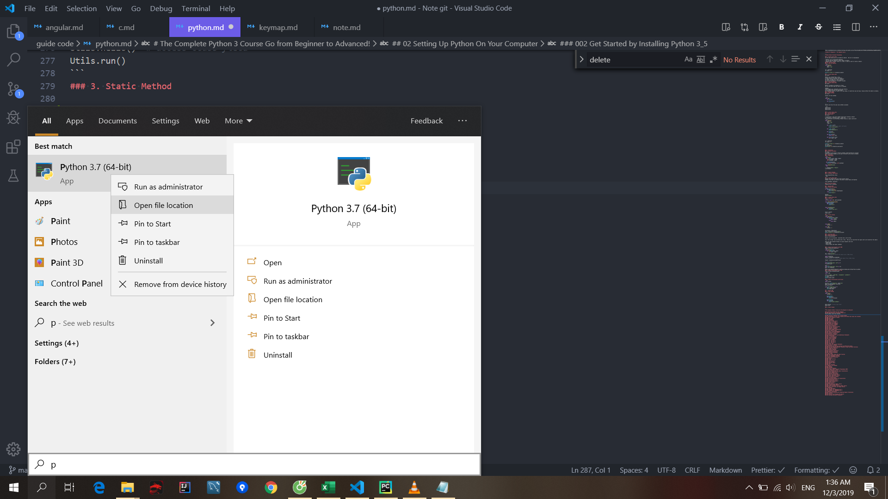
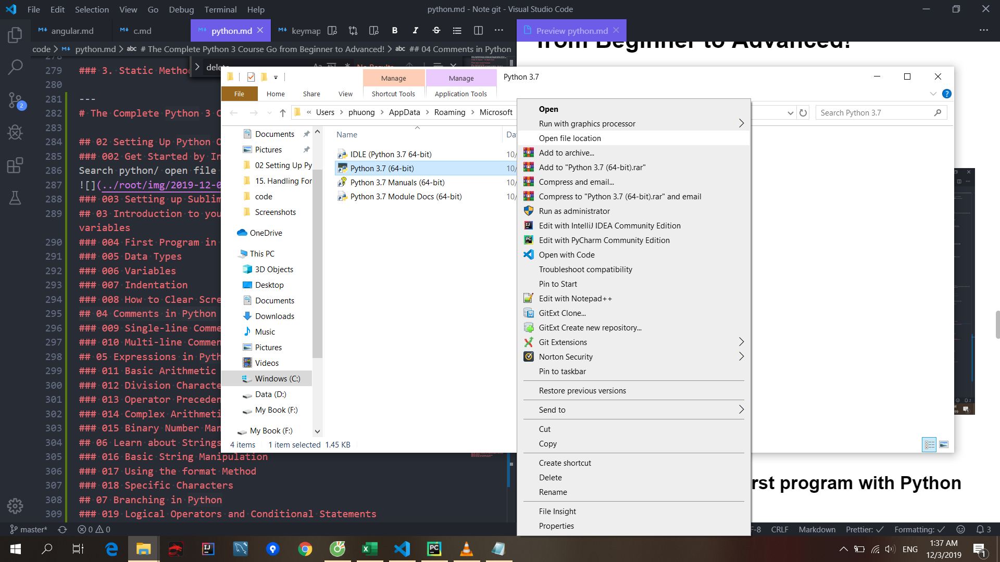
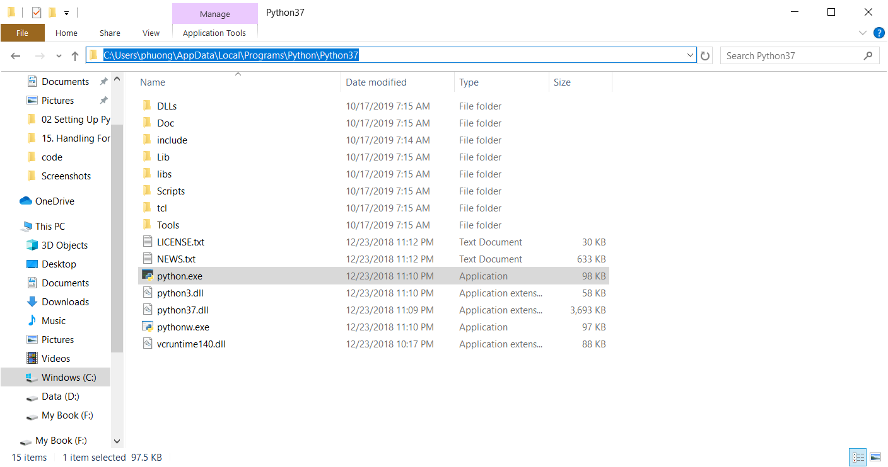

## WINDOWS Python Setup

https://www.tutorialsteacher.com/python

### 1. Installing Python On a PC

Search python/ open file location
 

 



copy path
Search: envi
System vari...
Add into PATH: C:\Users\phuong\AppData\Local\Programs\Python\Python37
Add into PATH: C:\Users\phuong\AppData\Local\Programs\Python\Python37\python.exe

  


Check

```py
python --version
python
quit()
```
